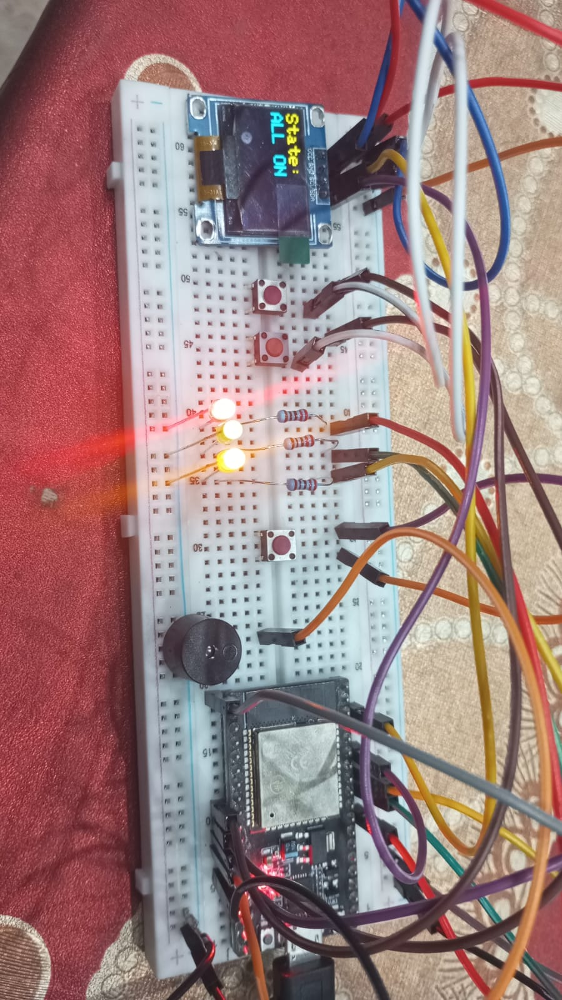

WOKWI LINK:
https://wokwi.com/projects/445785804299652097

WORKING PICTURES:

PIN MAP:

CODE:

HANDMADE DIAGRAM:

VIDEO OF WORKING:
<video controls src="PICS_VIDEO/WORKING_VIDEO.mp4" title="Title"></video>